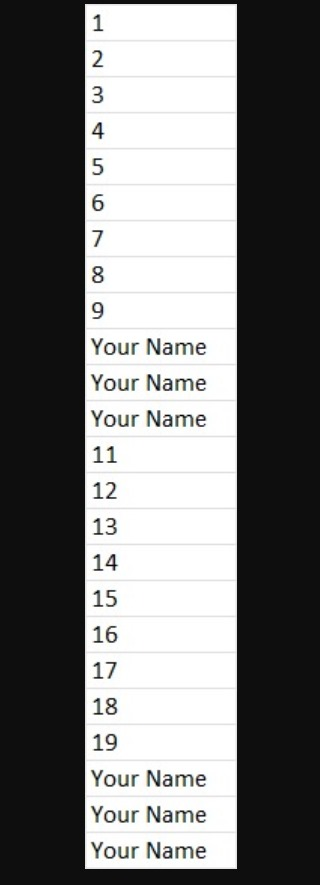
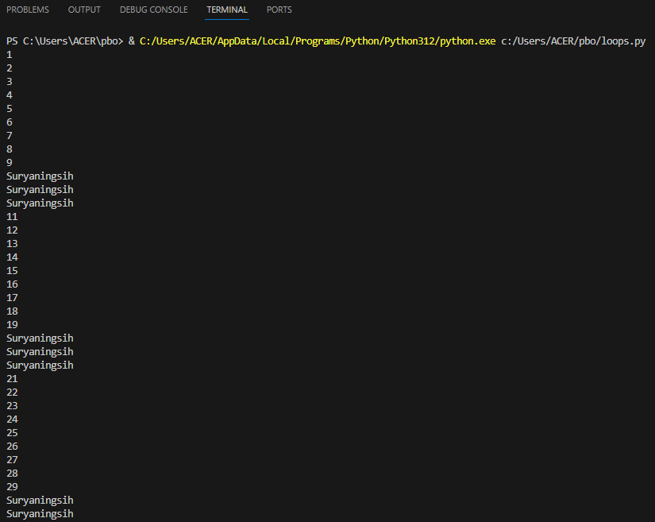
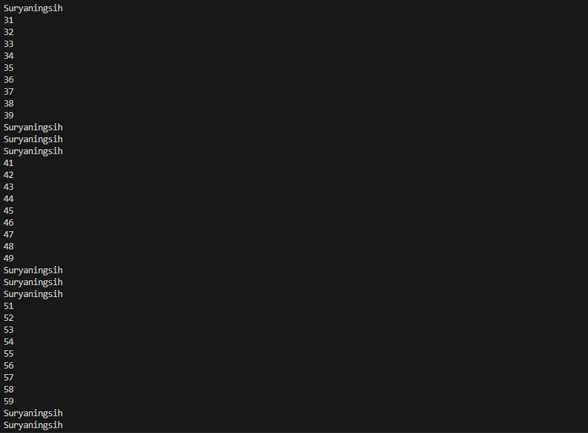
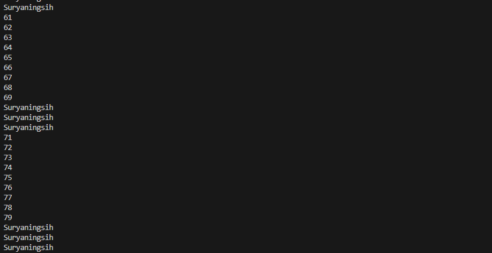
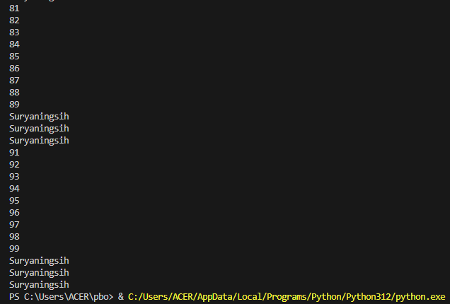
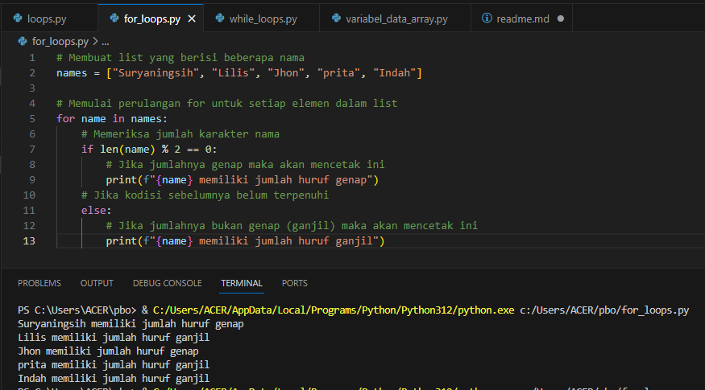
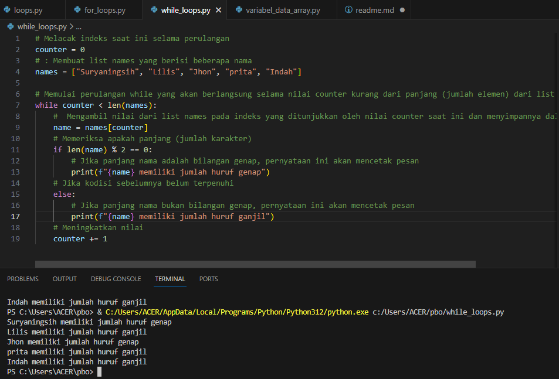
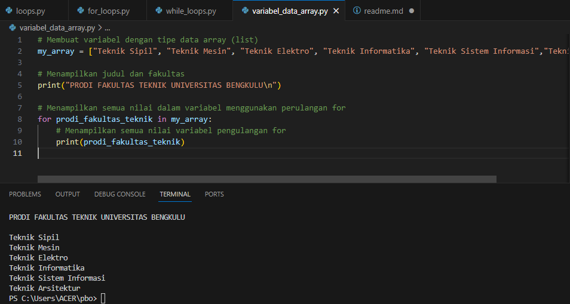

# TUGAS 1 PBO


#### Nama
```bash
 Suryaningsih
```

#### NPM

```bash
  G1F022049
```

#### Dosen Pengampu

```bash
  Arie Vatresia, S.T., M.Kom
```

#### Mata Kuliah

```bash
  Pemograman Berorientasi Objek
```
#### Asisten Dosen

```bash
  Randi Julian Saputra
```

## Soal

1. Buatlah perulangan hingga 100 menggunakan Python dengan output sebagai berikut:
 (https://github.com/randiijulian/randiijulian/assets/81604461/e32b6d92-7e3a-4323-a0e3-711009112c8e)

2. Buatlah program bebas, dengan menerapkan if else pada:\
  a. For Loops\
  b. While Loops

3. Buatlah sebuah variabel dengan tipe data array, kemudian tampilkan semua nilai dalam variabel tersebut menggunakan perulangan for
* Tindak plagiasi tidak akan dinilai
* Buatlah penjelasan pada tiap section code yang telah dibuat pada file Readme.md di repository github, jelaskan mulai dari penggunaan code, input data & code saat dijalankan serta screenshot saat code dijalankan, tampilkan hasil dalam bentuk tabel jika diperlukan dan buatlah sebagus mungkin. 
Reference: https://github.com/randiijulian/Machine-Learning-Terapan-Dicoding/blob/main/Recommender%20System/README.md

## Jawaban
1. Buatlah perulangan hingga 100 menggunakan Python dengan output sebagai berikut:

* Penyelesain




Penjelasan :\
  pengulangan (looping) dalam bahasa pemrograman komputer adalah proses menjalankan eksekusi (run) suatu blok kode selama kondisi yang menjadi acuan banyaknya perulangan masih terpenuhi. Biasanya perulangan ini akan membutuhkan sebuah variabel pembantu yang menjadi acuan kapan perulangan ini nantinya akan berhenti.

  Pada gambar diatas merupakan perulangan for untuk mengiterasi melalui angka 1 hingga 100. Untuk setiap iterasi, kode memeriksa apakah nilai iterasi merupakan kelipatan 10. Jika ya, maka program mencetak nama "Suryaningsih" sebanyak tiga kali; jika tidak, program mencetak nilai iterasi itu sendiri.

2.  Buatlah program bebas, dengan menerapkan if else pada:\
a. For Loops\
b. While Loops
* Penyelesaian

  a. For Loops

penjelasan :\
Dengan for loops ini kita bisa menggunakan hingga 3 buah indikator acuan yaitu batas bawah (start), batas atas (stop), step (increment / decrement yang digunakan untuk indeks perulangan). for loops dengan satu acuan dituliskan seperti berikut ini: for i in range (stop):
Nantinya perulangan akan dilakukan sebanyak acuan start yang mana indeksnya akan dimulai dari indeks (angka) ke 0 hingga indeks ke stop - 1.

  Pada gambar diatas merupakan perulangan for loops untuk melakukan analisis terhadap sejumlah nama yang disimpan dalam list names, kode ini memberikan perulangan informasi apakah jumlah karakter setiap nama dalam list names adalah bilangan genap atau ganjil, dan mencetak pesan yang sesuai untuk setiap nama yang ganjil atau genapnya jumlah karakter nama.

    b. While Loops
 
penjelasan :\
Pada while loops, perulangan akan dilakukan selama kondisi yang menjadi acuannya masih terpenuhi. Adapun penulisan perulangan while loops ini adalah sebagai berikut: while (kondisi):
Pada perulangan while loops ini kita sebelumnya harus mendeklarasikan sebuah variabel pembantu yang akan kita gunakan pada kondisi di atas. Disini kita dapat memanfaatkan operasi perbandingan (<, <=, >, >=, ==, !=) maupun boolean untuk mengecek apakah perulangan yang akan dilakukan masih memenuhi kondisi yang telah ditentukan.

  Pada gambar diatas merupakan perulangan while loops untuk melakukan mengiterasi melalui elemen-elemen dalam list names dan memberikan informasi apakah panjang (jumlah karakter) setiap nama adalah bilangan genap atau ganjil. dan mencetak pesan yang sesuai untuk setiap nama. Program akan terus berjalan hingga counter mencapai panjang dari list names, sehingga memastikan bahwa setiap nama telah diproses.
3.  Buatlah sebuah variabel dengan tipe data array, kemudian tampilkan semua nilai dalam variabel tersebut menggunakan perulangan for
* Penyelesaian
 
penjelasan :\
Tipe data array adalah tipe data yang terdiri dari kumpulan tipe data lain. Dalam bahasa Indonesia, array dikenal juga dengan istilah Larik. Dengan array, proses penyimpanan data ke dalam variabel menjadi lebih efisien dan mudah, terutama jika kita memiliki data dalam jumlah banyak
Anggota atau isi dari array itu sendiri harus satu jenis tipe data, misalkan terdiri dari kumpulan angka bulat saja (integer), kumpulan karakter saja (string/char), maupun kumpulan angka pecahan saja (float). Di dalam bahasa C, kita tidak bisa membuat 1 array dengan berbagai tipe data (harus 1 jenis saja).

  Pada gambar diatas merupakan perulanganfor dengan sebuah tipe data array,  untuk membuat variabel my_array yang merupakan tipe data list menggunakan tipe data string berisi beberapa program studi di Fakultas Teknik Universitas Bengkulu. Selanjutnya, kode menampilkan judul dan fakultas, kemudian menampilkan semua nilai dalam variabel tersebut menggunakan perulangan for. Dengan demikian, program memberikan daftar program studi di Fakultas Teknik Universitas Bengkulu.


